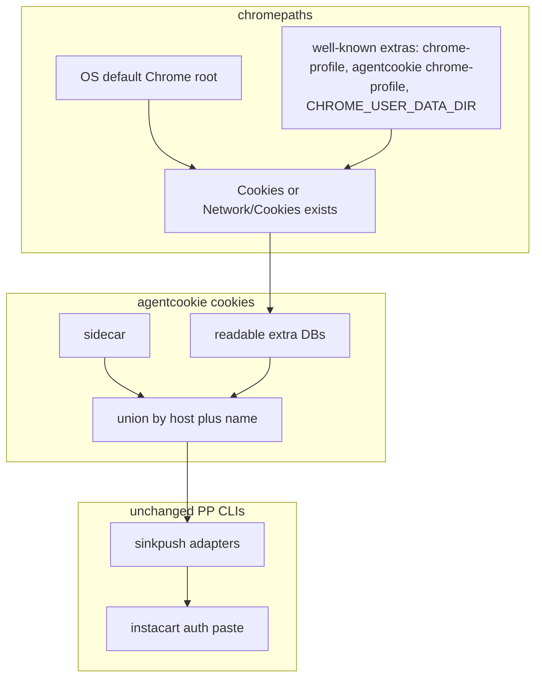

# feat: auto-discover extra Chrome profiles

## Goal Capsule

Make agentcookie find Chrome cookie stores outside the v0.7 macOS Default profile, including Linux agent user-data-dirs that have a Cookies database and no Local State, then deliver those cookies through existing agentcookie surfaces (`cookies --domain`, sidecar, sinkpush adapters). Do not change printing-press-library.

Authority: session-settled Key Decisions below. Consumption shape (shell-out, no Go import) still follows `docs/plans/2026-05-31-001-feat-generic-consumption-bridge-plan.md`.

Stop if the work ports libsecret decrypt, adds a Printing Press LookPath PR, or expands into a full Linux Tailscale source.

Execution: code. Landing: one PR on agentcookie.

## Product Contract

### Summary

`internal/chromepaths` is macOS Default-only. `agentcookie cookies` reads only the sidecar. Instacart `auth login` uses kooky, which skips any Chrome root without Local State. Agent Chromes (`~/chrome-profile`, `~/.agentcookie/chrome-profile`) often have Cookies and no Local State. This plan lifts that limit inside agentcookie. Existing adapters already push Instacart cookies via `instacart auth paste`; they do not need a PP repo change.

### Problem Frame

A signed-in Instacart session in a sandbox Chrome could not be read. kooky only considers default OS roots and requires Local State. agentcookie source reads a single macOS Default Cookies path. Linux source path helpers still join `Library/Application Support`. Linux never decrypts Chrome SQLite; the working Linux path is sidecar plus adapters, which the sink already writes.

### Key Decisions

- Primary PR is agentcookie only. session-settled: user 2026-08-13, "can this be done just with agentcookie and not touching printing press". Governs R1–R5.
- Auto-discover extra Chrome profiles on Mac and Linux. Cookies (or Network/Cookies) is enough; Local State is not a gate. session-settled. Governs R1, R2.
- PP CLIs consume via existing agentcookie surfaces, not a printing-press-library PR. session-settled. Governs R4, R5.

### Requirements

- R1. Discover Chrome user-data-dirs beyond Default, including Cookies without Local State, on Darwin and Linux.
- R2. `agentcookie cookies --domain` unions sidecar cookies with cookies from discovered readable stores. Same output contract (Cookie header default, `--json`).
- R3. `doctor` / `status` name every discovered store, the historical default, and skip reasons (no Cookies, locked, decrypt failed, Linux SQLite encrypted).
- R4. Extra-profile cookies that reach the existing cookie pipeline still fan out through sinkpush adapters. Instacart stays `auth paste`. No PP source change.
- R5. A local agent can run `agentcookie cookies --domain instacart.com` and feed existing `instacart auth paste` / `import-file` with no printing-press-library PR.

### Success Criteria

- Custom user-data-dir with Cookies and no Local State is listed by doctor, not silently skipped.
- On macOS, `cookies --domain instacart.com --json` returns cookies from that extra profile when they decrypt with the existing Keychain path.
- On Linux, encrypted SQLite values are skipped with a named reason; plaintext or sidecar values still emit. Default macOS Default-profile behavior is unchanged when no extra profiles exist.

### Actors

- A1. Human logged into a site in some Chrome.
- A2. Agent Chrome using a custom user-data-dir.
- A3. Instacart CLI, unchanged, reading session.json after adapter paste or after a human/agent pipes `cookies --domain` into `auth paste`.

### Key Flows

- F1. Discover stores -> read what this OS can decrypt -> union with sidecar -> `cookies --domain`.
- F2. Same cookie set -> existing sinkpush RunAll -> Instacart `auth paste` when that binary is installed.

### Acceptance Examples

- AE1. Fixture root with Default/Cookies and no Local State is discovered.
- AE2. Default-only macOS: discovery returns the current Default store; cookies command still matches sidecar-or-default behavior.
- AE3. Two profiles, session only in the extra one: `cookies --domain instacart.com` returns that session.
- AE4. Linux encrypted extra DB: doctor names the skip; command does not crash; sidecar cookies still emit.

### Scope Boundaries

#### Deferred to Follow-Up Work

- Any printing-press-library change (LookPath in Instacart `auth login`, cookiesource adoption, bulk kooky CLI patches, engine template).
- Linux libsecret / v11 SQLite decrypt.
- CDP Storage.getCookies harvest (Linux sink already uses CDP set, not get).
- Full Linux Tailscale source.
- Adapter `IsInstalled` binary-name mismatch (`instacart` vs `~/go/bin/instacart-pp-cli`) unless it blocks R4 verification; then a tiny agentcookie-only fix is allowed inside U4.

#### Out of scope

- Checkout / cart mutation.
- Importing agentcookie as a Go module from public PP CLIs.
- Changing kooky upstream.
- printing-press-library PRs.

### Sources

- Live failure: `instacart auth login` -> no kooky stores; Cookies at a custom user-data-dir; no Local State.
- kooky v0.2.2 `internal/chrome/find/find.go`: missing Local State skips the root.
- `internal/chromepaths/chromepaths.go`: macOS Default only, v0.7.
- `internal/cli/cookies.go`: sidecar only.
- `internal/config/config.go` `SourceBrowserCookiesPath`: always `Library/Application Support`.
- `internal/sinkpush/adapter_instacart.go`: `auth paste`, no PP change required.
- Pattern to copy (do not edit that repo): printing-press-library table-reservation-goat `internal/source/auth/chrome.go` / `chrome_test.go` (walk profile dirs, Network/Cookies then Cookies, no Local State gate).
- `docs/plans/2026-05-31-001-feat-generic-consumption-bridge-plan.md`.

## Planning Contract

### Assumptions

- Linux agentcookie will not decrypt Chrome SQLite in this PR. Extra-profile Linux success is discovery + doctor + sidecar/plaintext union.
- `cookiesource` stays unused by Instacart; that is fine because this plan does not change Instacart.
- Sealed sidecar (`agc1:`) on Linux still fails unless sealing is off (current default).

### Key Technical Decisions

- KTD1. `chromepaths` becomes a discovered list. A store is valid if Cookies or Network/Cookies exists. Local State is optional. Cites extra-profile Key Decision. Governs R1.
- KTD2. `cookies --domain` unions sidecar plus discovered stores this OS can read. Sidecar-only is not enough for unsynced agent Chromes. Governs R2.
- KTD3. No printing-press-library PR. Consume via `cookies --domain`, sidecar, and existing adapters. Governs R4, R5.
- KTD4. Linux is discovery/read-skip, not a libsecret port and not a full source/sink rewrite. Governs R1, AE4.
- KTD5. Copy the table-reservation-goat profile-walk allowlist (`Default`, `Profile N`, `Guest Profile`; skip Crashpad and cache dirs) into chromepaths tests. Do not edit that CLI. Governs R1.

### High-Level Technical Design

Where prose and the diagram disagree, prose governs.

### Sequencing

U1 discovery -> U2 cookies union and pipeline -> U3 doctor/status -> U4 adapter regression.

## Implementation Units

### U1. Discover extra Chrome profile roots

**Goal:** chromepaths returns usable stores on Darwin and Linux without requiring Local State.

**Requirements:** R1. KTD1, KTD4, KTD5. Covers AE1, AE2.

**Dependencies:** none.

**Files:** `internal/chromepaths/chromepaths.go`, `internal/chromepaths/discover.go` (new if needed), `internal/chromepaths/discover_test.go` (new, test), `internal/chrome/browser.go` (Linux path join), `internal/config/config.go` (`SourceBrowserCookiesPath` Linux roots).

**Approach:**
1. Keep current Default helpers as the default-root case.
2. Scan OS default Chrome/Chromium/Brave/Edge roots plus well-known extras (`chrome-profile` under home, `~/.agentcookie/chrome-profile`, `CHROME_USER_DATA_DIR` / config `cdp.profile_dir`).
3. Allowlist profile dir names; try Network/Cookies then Cookies; do not ReadFile Local State as a gate.
4. Fix Linux `SourceBrowserCookiesPath` so it does not use `Library/Application Support`.

**Patterns to follow:** table-reservation-goat chrome_test.go fixtures (temp dir, both cookie layouts, skip cache dirs). `internal/cli/browser_registry_consistency_test.go` as the path-agreement backstop.

**Test scenarios:**
- Default root with Local State plus Cookies is returned.
- AE1: Cookies and no Local State is returned.
- Both `Default/Cookies` and `Profile 1/Network/Cookies`.
- Crashpad / ShaderCache dirs are not stores.
- `CHROME_USER_DATA_DIR` is included.
- Linux helper does not return a macOS Library path.

**Verification:** `go test` for chromepaths and the browser-registry consistency test.

### U2. Union discovered stores into `cookies --domain`

**Goal:** `agentcookie cookies --domain` returns domain cookies from sidecar and from discovered stores this OS can read.

**Requirements:** R2, R5. KTD2. Covers AE3, AE4.

**Dependencies:** U1.

**Files:** `internal/cli/cookies.go`, `internal/cli/cookies_test.go`, `internal/cli/cookie_pipeline.go` (if source/sink should merge extra DBs), `internal/cli/source.go` as needed.

**Approach:**
1. Keep sidecar read and blocklist filtering.
2. Also read discovered DBs via existing `chrome.ReadCookiesForHost` with the current lock bypass.
3. On decrypt/lock error, skip that store; do not fail the command.
4. Union by host plus name; sidecar wins when both have a value unless tests show otherwise.
5. Preserve Cookie-header and `--json` output.

**Execution note:** Characterize current sidecar cookies tests first, then add extra-profile fixtures.

**Patterns to follow:** `collectDomainCookies` and `hostMatchesDomain` in `internal/cli/cookies.go`; `internal/cli/cookie_pipeline_test.go`.

**Test scenarios:**
- Sidecar-only: identical to current tests.
- Extra profile only: returns those cookies (AE3).
- Both present: union, no duplicate names for the same host.
- AE4: undecryptable extra DB omitted; sidecar still emits.
- Blocklist still applies to extra-profile cookies.

**Verification:** package tests for cookies and cookie_pipeline.

### U3. Doctor and status name discovered stores

**Goal:** Operators see which stores will be read and why one was skipped.

**Requirements:** R3. Covers AE2, AE4.

**Dependencies:** U1.

**Files:** `internal/cli/doctor.go`, `internal/cli/status.go`, corresponding tests.

**Approach:** List discovered roots, mark the historical default, print skip reasons. Never print cookie values.

**Patterns to follow:** existing doctor profile line.

**Test scenarios:**
- Default-only: one store, labeled default.
- Extra profile without Local State: listed as readable.
- Decrypt failure: skipped with reason, not silent.

**Verification:** doctor tests name the extra fixture profile.

### U4. Adapter fan-out still works on extra-profile cookies

**Goal:** Instacart adapter still pastes cookies that originated in an extra profile. No PP CLI source change.

**Requirements:** R4, R5. KTD3.

**Dependencies:** U2.

**Files:** `internal/sinkpush/adapter_instacart.go` (only if a tiny binary-path fix is required), `internal/sinkpush/adapter_instacart_test.go`, docs `docs/consumption.md` if the Linux sidecar sentence is still stale.

**Approach:**
1. Feed extra-profile cookies through the same RunAll path.
2. Keep `auth paste`. Do not add a PP import.
3. If `IsInstalled` looking only at `~/go/bin/instacart-pp-cli` makes R4 unverifiable, LookPath `instacart-pp-cli` and `instacart` inside agentcookie only.

**Test scenarios:**
- Extra-profile instacart host cookies produce the same paste header as today.
- Empty values still skipped.
- Missing binary: adapter skipped, cookies command still works (R5).

**Verification:** adapter tests pass; consumption.md does not claim Linux never writes sidecar if the code writes it.

## Verification Contract

- `make test` on Darwin; `go test ./...` on Linux CI (no -race), matching `.github/workflows/ci.yml`.
- Must-pass packages: `./internal/chromepaths`, `./internal/cli` (cookies, doctor, cookie_pipeline, browser_registry_consistency), `./internal/sinkpush`.
- No cookie values in logs or doctor.
- Manual smoke after merge: extra-profile fixture, `agentcookie cookies --domain instacart.com --json`, then existing `instacart auth paste` if that binary is installed.

## Definition of Done

- R1–R5 true.
- printing-press-library is untouched.
- Abandoned discovery experiments are not left in the diff.
- Help/doctor text no longer claims Default-only if extra profiles shipped.
- Linux still does not claim to decrypt Chrome SQLite.

## Appendix

Slack was available and not searched.
Repo research (2026-08-13) on agentcookie `b55e2f07` and printing-press-library `main` shaped KTD4 (Linux no SQLite decrypt), KTD5 (copy table-reservation walk into chromepaths), and the adapter binary-name note in U4.
