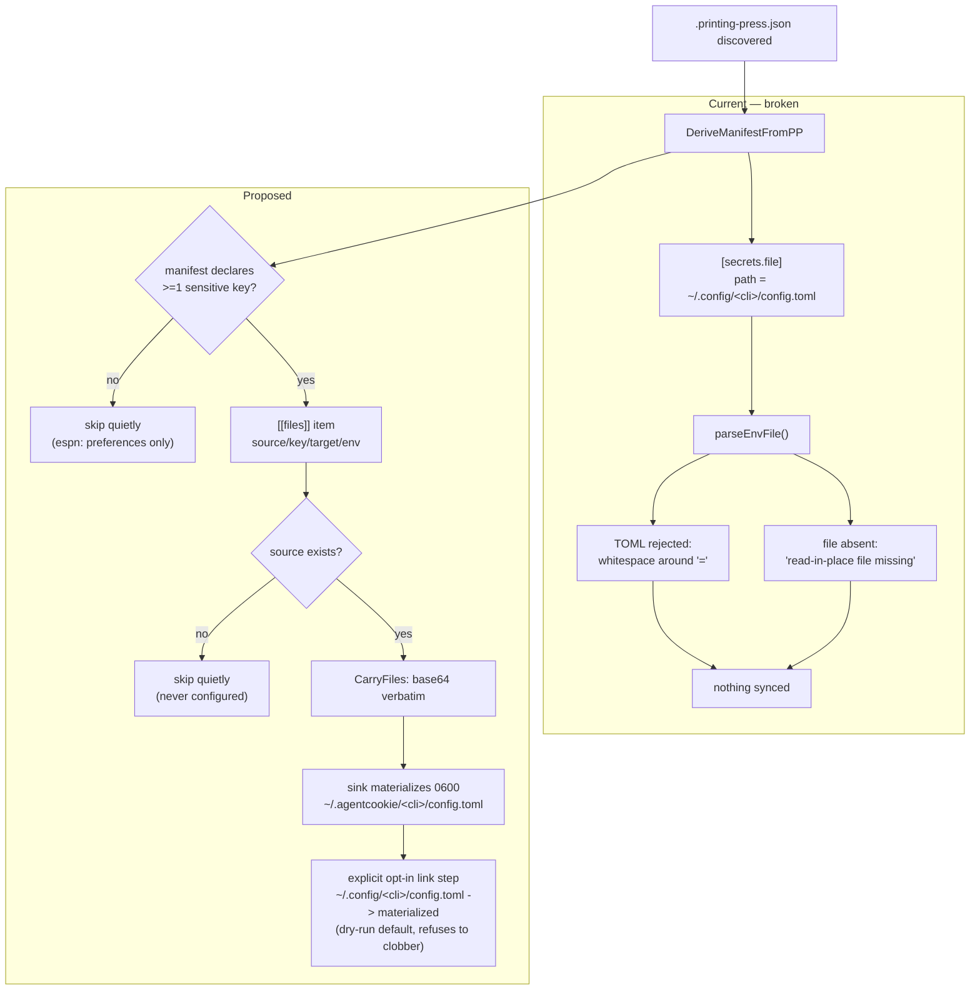

# fix: Carry PP CLI config.toml as a file instead of parsing it as dotenv

## Summary

Every auto-discovered Printing Press CLI fails to sync its secrets. `DeriveManifestFromPP` points `[secrets.file]` — a slot the manifest contract defines as env-shaped — at `~/.config/<cli>/config.toml`, which is real TOML. The strict dotenv reader rejects it, so roughly a dozen configured CLIs silently ship nothing, and roughly two dozen unconfigured CLIs emit a `file missing` error on every push.

The fix is at the adapter, not the parser: derive a `[[files]]` carriage item (machinery that already exists and is designed for this) instead of an env read-in-place, gate it on the manifest declaring at least one sensitive key, and stop reporting never-configured CLIs as errors.

---

## Problem Frame

`agentcookie source --once` prints ~40 `secrets-bus` errors, one per discovered project, in two classes:

- **Parse failures (~13).** `read ~/.config/<cli>/config.toml: line 1: whitespace around '=' is not allowed`, or `missing '=' (expected KEY=VALUE)` where the file opens with a `[table]` header. These CLIs have real credentials on disk that never reach the sink. This is silent data loss — the push reports the error but exits having synced nothing for that CLI.
- **Missing files (~26).** `read-in-place file missing: ~/.config/<cli>/config.toml`. Most of these directories do not exist at all; the CLI has simply never been authenticated. An unconfigured CLI is a normal state, not an error.

Causal chain:

1. `Discover` auto-detects PP CLIs from `.printing-press.json` manifests.
2. `DeriveManifestFromPP` (`internal/secretsbus/pp_cli_adapter.go:57-63`) synthesizes `Secrets.File.Path = ~/.config/<cli_name>/config.toml`, citing `docs/audits/2026-05-22-pp-cli-auth-inventory.md` for the canonical path.
3. `LoadPayloadWithDiscovery` (`internal/secretsbus/discover_merge.go:48`) reads that path with `parseEnvFile` unconditionally, regardless of extension.
4. `parseEnvFile` (`internal/secretsbus/secretsbus.go:204-214`) is strict dotenv: it rejects any whitespace around `=` and any line without `=`.
5. PP CLIs write canonical TOML there (`base_url = "..."` with spaces; espn opens with `[favorites]`).

The audit the adapter cites as its source records these files as `toml` format throughout, and at line 143 already names the problem — "structured data the dotenv shape cannot express" — recommending a `[sync.files]` table for "non-env-shaped artifacts" (line 249). The adapter adopted the audit's *path* and did not carry across its *format* finding.

---

## Goal Capsule

Configured PP CLIs sync their credentials to the sink in a form the CLI can actually consume on arrival; unconfigured CLIs are quiet; preference-only CLIs are not swept in.

---

## Requirements

- **R1.** A PP CLI with a populated `~/.config/<cli>/config.toml` must have that config reach the sink. No silent no-op.
- **R2.** A PP CLI that has never been configured (no config dir, or no `config.toml`) must not produce an error line on push. It is skipped quietly.
- **R3.** A PP CLI whose config holds no sensitive fields (espn: "no secrets — favorites list only", audit line 52) must not have its config carried at all.
- **R4.** A carried config must be consumable by the CLI on the sink machine — materialized where that CLI's documented resolution order will find it.
- **R5.** No regression for the v1 bus, or for hand-written v2 manifests that legitimately declare an env-shaped `[secrets.file]`. Those keep today's parse-and-filter behavior, including its error reporting.

---

## Key Technical Decisions

**KTD1. Fix the adapter to emit `[[files]]` carriage; do not teach `parseEnvFile` to read TOML.**
`ManifestV2SecretsFile` is documented as "points at an env-shaped file the agent reads in place" (`internal/secretsbus/manifest_v2.go:99-103`). Teaching the env reader TOML would violate that contract for every consumer, and would require a lossy flattening rule for nested tables (`[favorites] nba = "..."` has no dotenv spelling) plus type coercion for non-string TOML values. `[[files]]` already exists for this exact case — its doc example is a pp-cli `config.toml` (`manifest_v2.go:56-62`), it carries bytes verbatim, and the sink materializes 0600. Governs R1, R4.

**KTD2. Gate carriage on the manifest declaring at least one sensitive key.**
Whole-file carriage has no per-key filter, so it bypasses the `sync.default=false` + `ShouldShipKey` policy that the `[secrets.file]` path applies. Without a gate, espn's preferences would ship where today they are correctly dropped. Carry only when `Sync.Keys` contains at least one `true`. Governs R3.

**KTD3. Demote missing-source to a quiet skip for auto-derived manifests only.**
A derived manifest asserts a *conventional* path that may not exist; a hand-written manifest asserts a path its author explicitly chose, where absence is a real misconfiguration. Distinguish by manifest provenance, not by path. Governs R2, R5.

**KTD4. Carry key naming: `<ENVNAME>_CONFIG_TOML`, hyphens folded to underscores.**
`CarryFiles` validates keys with `validKeyName`, so `booking-com-pp-cli` must become `BOOKING_COM_PP_CLI_CONFIG_TOML`. Reuse the existing env-name derivation rather than inventing a second one.

**KTD5. Materialize inside `~/.agentcookie/` as today, and expose the config to the CLI through an explicit, opt-in sink-side link step.** (session-settled: user-directed — chosen over an env pointer and over writing directly into `~/.config/`: only 2 of 59 installed CLIs can follow an env pointer, and a direct `~/.config/` write would widen the sink's manifest-driven write authority.)

Measured on this machine (method in Sources): PP CLIs only honor `XDG_CONFIG_HOME` / `<envName(api_name)>_CONFIG_DIR` if built after roughly 2026-07-01. ordertogo (2026-06-24) ignores both; human-goat (2026-07-03) and juneoven (2026-07-10) honor both. **2 of 59 installed binaries qualify.** `--config <file>` works universally but is set by whoever invokes the CLI, which the bus does not control.

So an env pointer alone leaves 57 CLIs broken, and writing straight into `~/.config/<slug>/` would break the containment invariant that `validateMaterializeTarget` exists to enforce (`internal/secretsbus/manifest_v2.go:314-338`) — the sink's defense against a manifest naming an arbitrary write path. The link step keeps every manifest-driven write sandboxed while still reaching all 59 CLIs, and moves the one privileged write into an explicit user action that can refuse to clobber a real config. Governs R4.

Note the env-name derivation, which the earlier draft had wrong: the config *directory* comes from `cli_name` (`juneoven-pp-cli`) while the env *variable* comes from `api_name` (`JUNEOVEN_CONFIG_DIR`). `JUNEOVEN_PP_CLI_CONFIG_DIR` is ignored.

---

## High-Level Technical Design

The carried bytes are never parsed by the bus. Structure, comments, and types survive the trip intact, which is what makes nested tables and non-string values a non-issue.

---

## Scope Boundaries

**In scope:** the derivation path for auto-detected PP CLIs, the error reporting for absent derived sources, and the directory-pointer env semantics needed for a carried config to be usable.

**Out of scope (true non-goals):**
- Teaching `parseEnvFile` any non-dotenv format.
- Changing the v1 bus, or hand-written v2 manifest behavior.
- The sink-side network reliability observed while diagnosing this (unrelated: transport, not format).

### Deferred to Follow-Up Work
- **Companion files.** The audit records that several CLIs keep auth beside `config.toml` — `cookies.json` (airbnb, ordertogo), `browser-session-proof.json` (ebay, openart, suno), and Linear's `LINEAR_API_KEY` env var. Those need their own `[[files]]` items; this plan carries `config.toml` only.
- **Per-file `local-only` markers** (audit line 249) for artifacts that must never ship.
- **Field-level redaction** for account-identity fields the audit flags with caution (ordertogo `customer_phone`).

---

## Implementation Units

### U1. Derive `[[files]]` carriage instead of env read-in-place

**Goal:** A discovered PP CLI produces a manifest that carries its `config.toml` as a file, and preference-only CLIs produce nothing.

**Requirements:** R1, R3 (KTD1, KTD2, KTD4)

**Dependencies:** none

**Files:**
- `internal/secretsbus/pp_cli_adapter.go`
- `internal/secretsbus/pp_cli_adapter_test.go`

**Approach:**
1. Compute the sensitive-key set from `auth_env_var_specs` (or `auth_env_vars` fallback) exactly as today.
2. If no key is sensitive, return a manifest with neither `Secrets.File` nor `Files` — discovery then contributes nothing for that CLI.
3. Otherwise emit a single `ManifestV2File`: `Source: ~/.config/<cli>/config.toml`, `Key: <ENVNAME>_CONFIG_TOML`, `Target: <cli>/config.toml`, `Optional: false`, `Env` per U3.
4. Stop setting `Secrets.File` on derived manifests. Keep `Sync` populated — it still describes intent and is read elsewhere.

**Patterns to follow:** the `[[files]]` example at `internal/secretsbus/manifest_v2.go:56-62`; existing derivation and validation flow in `DeriveManifestFromPP`.

**Test scenarios:**
- A manifest with `auth_env_var_specs` containing a `sensitive: true` entry yields exactly one `Files` item with the expected source, target, and key, and a nil `Secrets.File`.
- A hyphenated `cli_name` (`booking-com-pp-cli`) yields a carry key that passes `validKeyName`.
- A manifest with only `sensitive: false` specs (espn shape) yields no `Files` item and no `Secrets.File`.
- A manifest using the legacy `auth_env_vars` fallback still yields a carry item, since that path treats all keys as shipped.
- An empty or invalid `cli_name` still errors exactly as today.

**Verification:** derived manifests for a sensitive CLI and for espn differ as specified, with no `[secrets.file]` on either.

---

### U2. Stop reporting never-configured derived sources as errors

**Goal:** Unconfigured PP CLIs are skipped silently; hand-written manifests still report a missing declared path.

**Requirements:** R2, R5 (KTD3)

**Dependencies:** U1

**Files:**
- `internal/secretsbus/discover_merge.go`
- `internal/secretsbus/discovery.go`
- `internal/secretsbus/discover_merge_test.go`

**Approach:**
1. Mark provenance on the registered project when the manifest was synthesized rather than parsed from disk — a field on the registry entry alongside `Kind`, set where `DeriveManifestFromPP` is called.
2. In `LoadPayloadWithDiscovery`, when a source is absent and the manifest is derived, skip without appending an error. Keep the existing error for parsed manifests.
3. Apply the same rule to the `CarryFiles` "source missing" error, which otherwise reintroduces the identical noise through the carriage path.

**Approach note:** step 3 is the easy miss — moving to carriage relocates the missing-file report from `discover_merge.go:51` to `filecarriage.go:95`, so fixing only the former leaves the noise in place under a new message.

**Patterns to follow:** the existing non-fatal error accumulation contract described at `internal/secretsbus/discover_merge.go:18-20`.

**Test scenarios:**
- A derived project whose source does not exist contributes no error and no payload.
- A hand-written manifest whose declared `[secrets.file]` path is absent still produces the `read-in-place file missing` error.
- A derived project whose source exists but is unreadable (permissions) still errors — absence is quiet, failure is not.
- A push with only unconfigured CLIs returns an empty error slice.

**Verification:** `agentcookie source --once` on this machine prints no line for any CLI lacking a config dir.

---

### U3. Explicit sink-side link step for carried configs

**Goal:** On the sink, a user can link carried configs into the locations their CLIs actually read, without the bus itself ever writing outside `~/.agentcookie/`.

**Requirements:** R4 (KTD5)

**Dependencies:** U1 (needs carried configs to link)

**Files:**
- `internal/cli/secret.go`
- `internal/secretsbus/filecarriage.go`
- `internal/secretsbus/filecarriage_test.go`

**Approach:**
1. Add a sink-side subcommand that walks materialized carried configs under `~/.agentcookie/` and, for each, links `~/.config/<slug>/config.toml` to the materialized file.
2. Default to a dry run that prints what it would link. Require an explicit flag to act — this is the one privileged write, so it should not happen implicitly.
3. Refuse to overwrite an existing regular file. Only an absent path, or a symlink already pointing into `~/.agentcookie/`, is a safe target. Never follow a symlink out and write through it.
4. Re-validate the slug with the existing v2 slug rules before composing any path, so a malformed slug cannot produce a surprising destination.
5. Leave `validateMaterializeTarget` and the bus write path untouched — the invariant is the point.

**Execution note:** this unit creates the only code path in the change that writes outside `~/.agentcookie/`. Write the refuse-to-clobber and refuse-to-traverse tests first, and make them fail for the right reason before the happy path exists.

**Patterns to follow:** existing sink-side command structure in `internal/cli/secret.go`; the containment posture of `validateMaterializeTarget`.

**Test scenarios:**
- Absent destination: linking creates the symlink and reports it.
- Destination is an existing regular file: refused, unchanged on disk, non-zero exit or explicit error line.
- Destination is a symlink already pointing into `~/.agentcookie/`: re-pointed, treated as owned.
- Destination is a symlink pointing outside `~/.agentcookie/`: refused, and the write does not follow it.
- Dry run is the default: no filesystem mutation without the explicit flag.
- Traversal-bearing or malformed slug: rejected before any path is composed.
- A carried file that is not a `config.toml` is not linked by this command.

**Verification:** on a machine with carried configs, the dry run lists the expected links; running with the flag makes `<cli> doctor` report a `config_path` resolving to the materialized file; an existing real config is never replaced.

---

### U4. End-to-end coverage over real PP CLI shapes

**Goal:** The three shapes on this machine are proven end to end.

**Requirements:** R1, R2, R3

**Dependencies:** U1, U2, U3

**Files:**
- `internal/secretsbus/discover_merge_files_test.go`

**Approach:** drive `LoadPayloadWithDiscovery` against a temp home holding three fixtures — a canonical scaffold CLI with sensitive keys and a populated TOML, a preference-only CLI (espn shape, including a `[favorites]` table), and a discovered-but-unconfigured CLI with no config dir. Assert on the merged payload and the error slice together.

**Execution note:** build fixtures from the shapes recorded in `docs/audits/2026-05-22-pp-cli-auth-inventory.md` rather than copying real user configs.

**Test scenarios:**
- Canonical CLI: payload carries the base64 config, the target key, and the directory pointer; the decoded bytes are byte-identical to the source, `[table]` headers and comments intact.
- espn shape: contributes nothing, and its `[favorites]` table never appears in the payload.
- Unconfigured CLI: contributes nothing and no error.
- All three together: exactly one CLI in the payload, and an empty error slice.
- v1 precedence is unaffected — a v1 key still wins over a v2 contribution for the same slug.

**Verification:** the suite fails on `main` and passes after U1-U3.

---

### U5. Update the spec and close the audit finding

**Goal:** The manifest documentation states how derived PP CLI configs are carried, so the next reader does not re-derive the env-shaped assumption.

**Requirements:** R1, R4

**Dependencies:** U1, U3

**Files:**
- `docs/spec-agentcookie-secrets-bus-v2-adoption.md`
- `docs/audits/2026-05-22-pp-cli-auth-inventory.md`

**Approach:** document PP CLI derivation as file carriage, state the sensitive-key gate, document the directory pointer next to the existing `env` field, and mark the audit's line 143 / line 249 finding as addressed for `config.toml` with companion files still open.

**Test expectation:** none — documentation only.

**Verification:** the spec describes the shipped behavior, and no doc still describes derived PP CLIs as env read-in-place.

---

## Risks & Dependencies

- **Whole-file carriage ships more than the per-key policy would.** A canonical scaffold config carries all seven fields plus extras, where `ShouldShipKey` would have filtered to the sensitive set. KTD2's gate is coarse — it decides whether to carry a file, not which fields. Accepted here because the CLI needs its own config shape to function, but it means a config holding both a secret and something the user would not sync ships wholesale. The audit's per-file `local-only` marker is the real answer; it is deferred.
- **U3 introduces the change's only write outside `~/.agentcookie/`.** It is explicit, opt-in, dry-run by default, and refuses to clobber, but it is still the highest-risk unit here and deserves the closest review.
- **The sensitivity gate is only as good as the PP metadata.** Measured after implementation: a CLI declaring no `auth_env_vars` and no `auth_env_var_specs` (booking-com, ebay) is excluded by KTD2 even though its `config.toml` holds an access token. This is not a regression — those CLIs did not sync before either — but the fix does not reach them. The gate cannot be loosened to catch them, because espn also declares nothing, and metadata alone cannot separate "has no secrets" from "did not say." The fix belongs in those CLIs' `.printing-press.json`, in `cli-printing-press`.
- **57 of 59 installed CLIs remain on stale binaries.** The link step works around that rather than fixing it. Rebuilding those CLIs on a newer Printing Press would make the env-pointer path viable and the link step optional; that is a `cli-printing-press` concern, not this repo's.
- **Sink-side materialization is assumed working.** It is exercised by `filecarriage_test.go` but has not been verified end to end against a live sink in this investigation — the sink was unreachable throughout (unrelated transport problem).
- **Behavior change on quieting errors.** Anyone relying on the `file missing` lines to notice an unconfigured CLI loses that signal. A `--verbose` or debug-level line would preserve it; not specified here.

---

## Open Questions

- ~~Should a carried config materialize into the sink's real `~/.config/<cli>/`?~~ **Settled 2026-08-13:** no. The bus keeps its containment invariant; an explicit opt-in link step (U3) bridges the gap. See KTD5 for the measurement that decided it.
- Should the sensitive-key gate be per-file rather than per-manifest, so a CLI with both sensitive and preference files carries only the former?
- Do any discovered CLIs legitimately use an env-shaped `[secrets.file]` today that U1 would regress by removing? Discovery of a real case would make the change conditional on file extension rather than unconditional.

---

## Verification Contract

- `go build ./...` and `go vet ./...` clean.
- `go test ./internal/secretsbus/...` passes, including U4's new end-to-end coverage.
- `agentcookie source --once` on a machine with these configs prints zero `secrets-bus` lines for unconfigured CLIs and zero parse errors for configured ones.
- A configured CLI appears in the push payload with byte-identical config content.
- Sink-side verification of materialization is required before this is called done, and needs a reachable sink.

## Definition of Done

R1-R5 hold; U1-U5 landed; the verification contract passes; the spec no longer describes derived PP CLIs as env read-in-place; deferred items are recorded rather than silently dropped.

---

## Sources & Research

- `internal/secretsbus/pp_cli_adapter.go:57-63` — the derivation that sets the TOML path on the env-shaped slot.
- `internal/secretsbus/discover_merge.go:47-56` — unconditional `parseEnvFile` on the derived path.
- `internal/secretsbus/secretsbus.go:204-214` — the strict dotenv reader.
- `internal/secretsbus/manifest_v2.go:43-103` — `[[files]]` carriage contract and the env-shaped `[secrets.file]` definition.
- `internal/secretsbus/filecarriage.go:73-121` — carriage, opt-in gate, size cap, companion keys.
- `docs/audits/2026-05-22-pp-cli-auth-inventory.md` — per-CLI format inventory; line 52 (espn has no secrets), line 143 (dotenv cannot express structured data), line 249 (per-file markers for non-env-shaped artifacts).
- `cli-printing-press` `internal/generator/templates/skill.md.tmpl:357-358` — documented PP CLI config resolution order and `<ENVNAME>_CONFIG_DIR`. Note this documents the *current template*, not what installed binaries do; the probe below is what settled KTD5.
- **Empirical config-resolution probe, 2026-08-13.** Method: write a `config.toml` carrying a sentinel `base_url` into a temp dir, invoke `<cli> doctor` (which reports the resolved `config_path`) under each candidate mechanism, and check which path and value it reports. Results: espn (built 2026-05-07), tesla (05-22), prediction-goat (05-22), ordertogo (06-24) ignore `XDG_CONFIG_HOME`, `<API>_CONFIG_DIR`, and `<SLUG>_CONFIG_DIR`; human-goat (07-03) and juneoven (07-10) honor `XDG_CONFIG_HOME` and `<API>_CONFIG_DIR` but not `<SLUG>_CONFIG_DIR`. `--config <file>` works on every binary tested. Installed-binary age distribution: 55 built 2026-05, 2 in 06, 2 in 07.
- Observed failure: 40 error lines across 4 runs of `agentcookie source --once` on 2026-08-13, in the two classes described in the Problem Frame.
